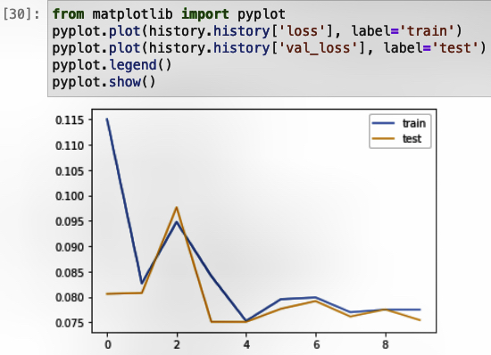
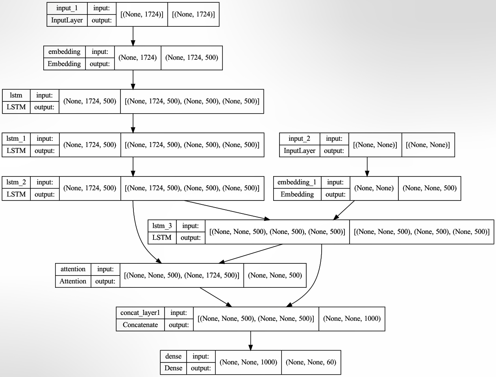
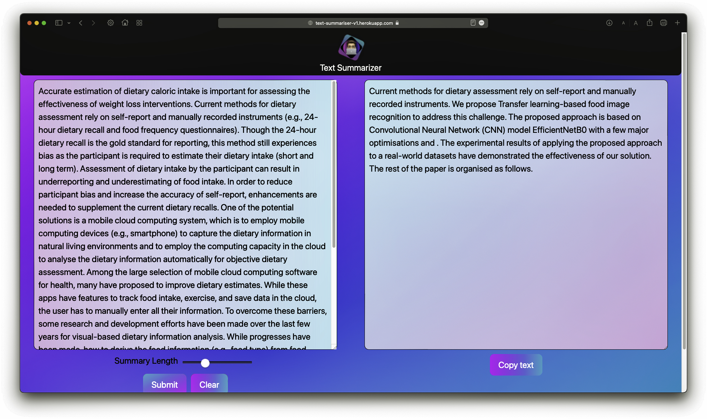

# Snoopify Summaries 🌟

Snoopify Summaries is a web application that allows users to generate summaries of YouTube videos quickly and efficiently. Whether you're looking to review educational lectures, catch up on podcasts, or stay updated on product launches, Snoopify Summaries has you covered! An Abstractive text summarizer trained using lstm based sequence to sequence model with attention mechanisim. The attention model is used for generating each word of the summary conditioned on the input sentence.

- Used CNN_DailyMail dataset.

### Training Model Overview

1) Loss graph

2) encoder-decoder overview

## Features

- Summarize any YouTube video with just the video link.
- Get concise summaries of podcasts, lectures, product reviews, and more.
- Display video details including title, channel name, and duration.
- Estimated read time for each summary to help manage your time effectively.

## How to Use

1. Enter the YouTube video link into the provided text input.
2. Click the "Summarize" button to generate the summary.
3. View the summary and estimated read time displayed below.

## Technologies Used

- Python: Backend language for data processing and web application development.
- Streamlit: Python library used for building interactive web applications.
- Hugging Face Transformers: Library for natural language processing tasks, used for text summarization.
- Pytube: Python library for downloading YouTube videos and retrieving video metadata.
- YouTube Transcript API: Python library for retrieving YouTube video transcripts.
- Tensorflow

## Installation

To run the Snoopify Summaries web app locally, follow these steps:

1. Clone this repository to your local machine.
2. Install the required Python dependencies listed in `requirements.txt`.
3. Run the Streamlit app using the command `streamlit run app.py`.
4. Access the web app in your browser at the provided URL.

## Deployment:

- https://snoopifysumaries.streamlit.app/

## Conclusion
- 🫶  The machine learning model to convert a text document to abstract is done successfully.
- 🫶  Created a streamlit app using an api call from my hugging face repository & LSTM Model.

- 
## Feedback and Contributions

Feedback, bug reports, and contributions are welcome! If you encounter any issues or have suggestions for improvements, please feel free to open an issue or submit a pull request on GitHub.

## License

This project is licensed under the MIT License - see the [LICENSE](LICENSE) file for details.
